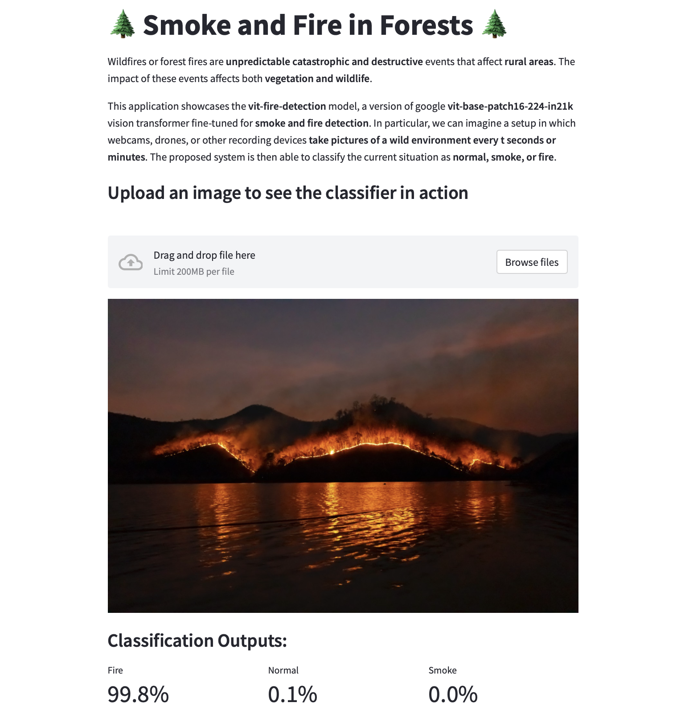

# Transformers-Based Smoke and Fire Detection in Forest Environments

## Overview

The proposed system consists of **two main solutions**. In the first solution we design, train, and evaluate a **custom CNN**. Regarding the second solution, we will fine-tune a pretrained **vision transformer**, the Google ViT [1], hosted on the Hugging Face Hub [2]. Results are logged and proposed through WanDB [3]. The performance of the two solutions will be compared and different aspects will be discussed.

The framework used for this experiment is PyTorch with the PyTorch Lightning Module. The final web application to showcase the model is written in Python using the Streamlit library and hosted on the Hugging Face Hub.

## Data Sources

The dataset used in this project is **self-built** by merging two **datasets from Kaggle**. In particular, we used samples from ”train_fire” and ”train_smoke” from [4], and all the samples (mixed together from further splitting) from [5].

The final dataset consists of **2525 samples for each of the three classification classes** (fire, smoke, normal). This dataset will be then split into train, validation, and test sets. The images in the dataset depict **fires of different magnitude**, **from different perspectives** (aerial, far, near) thus **simulating images from different devices**, such as webcams and drones.

## Demo Web Application

To showcase the final model, we developed a simple web application, available at https://huggingface.co/spaces/EdBianchi/Forest-Fire-Detection The demo allows the user to upload an image and predict if there is a smoke, fire or normal situation. We report here a screenshot of the GUI.

## References

[1] B. Wu et al., Visual Transformers: Token-based Image Representation and Processing for Computer Vision. arXiv, 2020. doi: 10.48550/ARXIV.2006.03677.

[2] Hugging face[EB/OL]. https://huggingface.co.

[3] Biewald L. Experiment tracking with weights and biases. Software available from wandb.com.

[4] KUTLU K. Forest fire dataset on kaggle[EB/OL]. https://www.kaggle.com/datasets/kutaykutlu/forest-fire?select=train_fire.

[5] PRASAD M S. Forest fire images dataset on kaggle[EB/OL]. https://www.kaggle.com/datasets/mohnishsaiprasad/forest-fire-images. 

